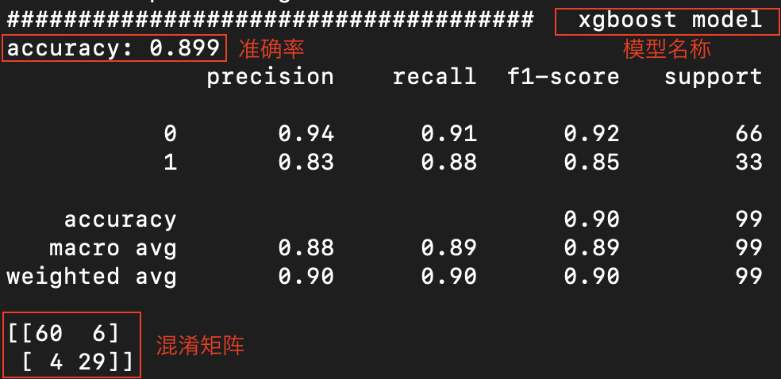

## Questionnair Train and Val

### 1. train:  train.py

`python3 train.py --questionnair` ml.csv (data csv) ` --label` label (label column)

(`python3 change_label.py -h` to see more)

### 2. train + save: trainAndSave.py

`python3 trainAndSave.py --questionnair` ml.csv (data csv) ` --label` label (label column)

> Output: model 文件夹下会有六个权重模型(.pickle文件)

### 3. predict:  val.py

`python3 val.py --questionnair` ml.csv (data csv) ` --label` label (label column)

### output msg

will print `xgboost`, `knn`, `gaussian`, `logistic regression`, `random forest`, `Svm`, `voting`  sequentially

